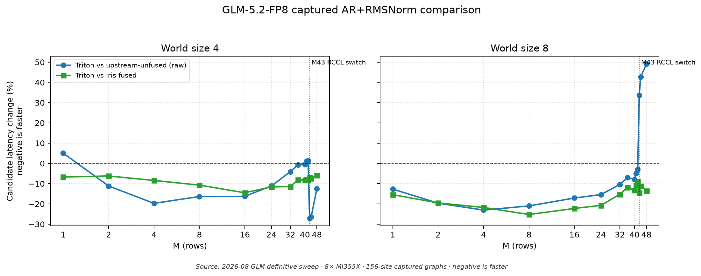
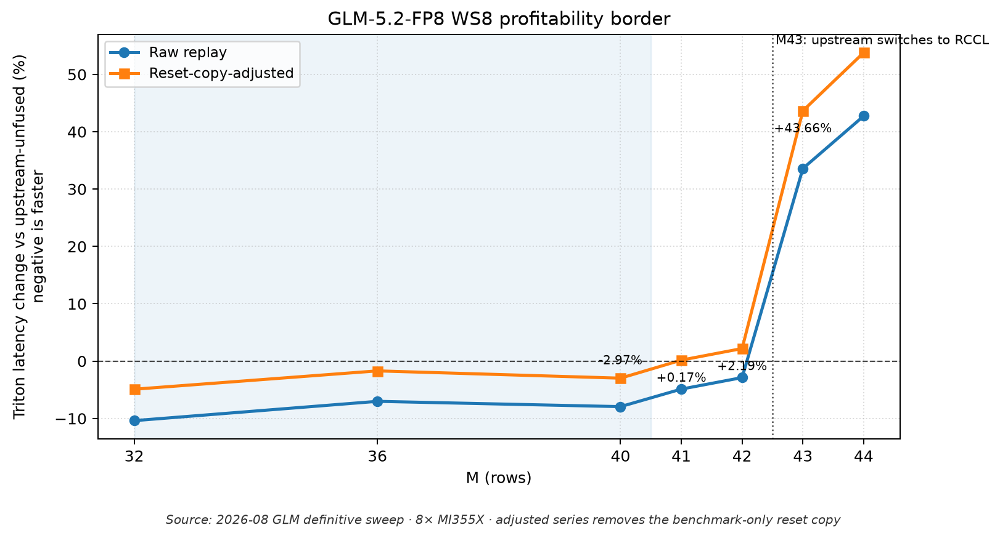
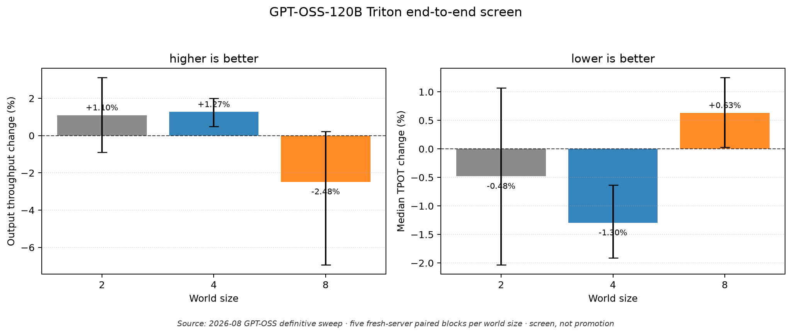
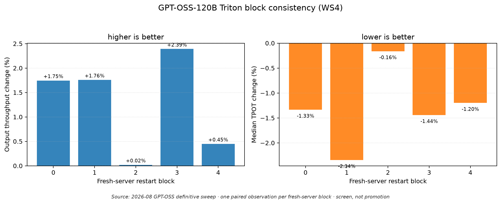

# AR+RMSNorm final results and public handoff

Updated: 2026-08-05

This report closes the current TokenSpeed effort to integrate fused all-reduce,
residual-add, and RMSNorm from triton-shmem. It synthesizes the completed
[GLM-5.2-FP8](../studies/mi350x/2026-08-glm-5.2-fp8-definitive-sweep/README.md)
and
[GPT-OSS-120B](../studies/mi350x/2026-08-gpt-oss-120b-definitive-sweep/README.md)
campaigns, the engineering path that made them possible, and practical restart
points for future contributors.

No further development or benchmarking is planned in this branch. The
GPT-OSS-120B 15-pair promotion stage remains intentionally incomplete. The
branch and its commit history are the implementation and investigation record;
the model-specific status pages remain authoritative for deployment policy.

## Executive conclusion

Triton-shmem fusion is not a universal replacement for unfused AR+RMSNorm, but
it advances the useful performance frontier in two concrete settings:

1. **GLM-5.2-FP8 has a strong captured-operator opportunity.** On the completed
   MI355X sweep, model-faithful WS8 graphs favor padded Triton through M42 by raw
   replay and through M40 after removing the benchmark-only reset copy. Padded
   Triton also beats Iris fused at every measured M for both WS4 and WS8. This
   supports Triton as the stronger fused backend candidate for the tested
   regimes; it does not, by itself, support enabling fusion over the current
   unfused deployment default.
2. **GPT-OSS-120B has a narrower but serving-visible WS4 opportunity.** The
   definitive five-block screen measured +1.27% output throughput and -1.30%
   median TPOT, with all five blocks favorable in both metrics. WS2 is
   inconclusive and WS8 loses. The result justifies interest in WS4, not a
   deployment change.

The benchmark and qualification system is also a major project result. It
separates eager timing, captured graphs, shared-state transitions, bounded
serving, marker-aligned forward analysis, and restart-randomized end-to-end
evidence. That separation prevented operator wins, benchmark copies, cold-start
stalls, and topology changes from being misreported as production gains.

Current deployment policy remains unchanged:

- [GPT-OSS-120B](gpt-oss-120b-status.md): explicit upstream-unfused on the
  qualified TP4 rank set; core-v3 remains a safety-qualified diagnostic.
- [GLM-5.2-FP8](glm-5.2-fp8-status.md): explicit upstream-unfused; profile v2
  remains an operator diagnostic rather than a serving profile.

## GLM-5.2-FP8: strongest operator evidence

The definitive GLM campaign completed all 315 scheduled results on 8x MI355X:
three world sizes, three arms, one- and 156-site graphs, dense boundary
coverage, 50 warmups, and 1,000 replays. Every iteration was reduced across
ranks first, then summarized, so the result represents collective max-rank
latency rather than a favorable rank median.

The 156-site graphs model the 78-layer architecture's two AR+RMSNorm sites per
layer. WS8 is the model-faithful configuration; WS2 and WS4 are collective
scaling diagnostics.



At WS8:

- raw replay favors Triton at every measured M from 1 through 42, by
  **2.87%-23.04%**;
- reset-copy-adjusted timing favors every measured M from 1 through 40;
- M41 is effectively tied after adjustment (**+0.17%**) and M42 loses
  (**+2.19%**);
- M43 crosses the 512 KiB ordinary-Iris boundary, switches upstream-unfused to
  RCCL, and makes padded Triton **33.59% slower**;
- Triton is faster than Iris fused at every measured point through M256.

The distinction between raw and adjusted timing matters. Upstream-unfused needs
a changing-input reset in this synthetic graph harness. Subtracting that copy
is a serving-shaped estimate, not a second kernel measurement. The adjusted
series is therefore a sensitivity check on the M40-M42 border, not a reason to
discard the predeclared raw result.



WS4 reinforces the backend-selection result but not a universal M cap. Triton
beats Iris at every measured M, while its ordering against unfused is
non-monotonic: raw replay loses slightly at M41/M42, becomes favorable again
when WS4 upstream switches transport at M43, and reaches a sustained loss after
M48. That behavior is why backend, world size, transport, and M must be treated
as one dispatch identity.

These MI355X results do not rewrite the existing MI350X profile. On MI350X, M1
lost and profile v2 selected padded Triton only for M2-M42. MI355X made M1
profitable, but transferring that result across hardware would violate the
project's qualification rules. Captured GLM serving and end-to-end behavior
also remain unmeasured.

The practical conclusion is narrower and stronger than a deployment claim:
once the model's FP8 GEMM/MoE and other kernels are representative enough for a
meaningful end-to-end comparison, Triton-shmem should be evaluated before Iris
as the fused backend for WS4 and WS8, especially in the M1-M40 range expected
to matter for large-model decode.

## GPT-OSS-120B: mixed microbenchmarks, promising WS4 serving

The GPT definitive campaign completed:

- 162 fresh-process captured-graph cases;
- 18 fresh-process eager cases;
- three 1,000-replay shared-state transition matrices;
- 18 marker-to-microbenchmark linkage analyses;
- 45 fresh-server lifecycles and 5,760/5,760 requests.

The complete microbenchmark matrix supported no positive actual-M gate, so
`fusion_max_m=0` was frozen for all three world sizes. This is an important
negative result: Triton was not uniformly faster at the operator level. For
example, reset-adjusted WS4 graph timing loses at M32 and M64, and dispatch
boundaries at M65, M92, and M385 materially change the comparison.

End-to-end behavior was more useful than a simple microbenchmark ranking:



- **WS2 is inconclusive:** +1.10% mean throughput with a 95% interval spanning
  zero, a -0.46% block median, and only two of five favorable blocks.
- **WS4 is promising:** +1.27% mean throughput (95% CI +0.49% to +2.01%) and
  -1.30% median TPOT (95% CI -1.91% to -0.63%).
- **WS8 loses the screen:** -2.48% mean throughput and +0.63% median TPOT. The
  magnitude is influenced by a block-0 cold wave, but four of five blocks still
  lose throughput and worsen TPOT.

WS4's value is its directional consistency, not only its mean:



Every WS4 block improves throughput (**+0.02% to +2.39%**) and median TPOT
(**-0.16% to -2.34%**). Leave-one-block-out throughput means remain positive.
This is credible evidence that fusion can move serving performance in a case
that matters, even though the measured operator rows do not predict it
directly.

It is still only a screen. Each block contains one paired observation, the
five-block arm-order generator repeated two earlier orders, and promotion
requires 15 correctly randomized pairs. A previous default-compatible 15-pair
WS4 campaign measured only +0.45% throughput (95% CI -0.05% to +0.92%) and
-0.51% median TPOT. The two campaigns used different current-machine and
serving identities and must not be combined. Together they support a WS4
restart point, not an enabled default.

## Engineering changes that mattered

The final state came from integration and lifecycle work as much as kernel
tuning.

### 1. Make captured serving safe before making it fast

Early graph-serving failures exposed requirements that are now explicit:

- padded graph rows must use a reserved sink, never a live request slot;
- captured outputs need graph-stable, persistent ownership;
- every declined fused call must execute complete all-reduce plus RMSNorm;
- state cache identity must include profile and allocation/lifetime policy;
- coarse HIP-IPC data buffers must remain separate from fine-grained signals;
- publication and barriers need system-scope ordering that covers sibling
  wavefront memory operations.

These fixes turned crashes, KV-page underflows, stale outputs, and races into
fail-closed dispatch. The durable contract is in
[backend design and safety](backend-design-and-safety.md) and
[producer lifetime](producer-lifetime-contract.md).

### 2. Align storage lifetime with graph lifetime

The realigned integration added model-sized graph-stable input and output site
rings: 72 sites for GPT-OSS and 156 for GLM. It removed the one-shot exit
barrier only for the qualified GPT profile, retained generic synchronization
elsewhere, and borrowed ping-pong outputs for eager two-shot calls. These
changes removed avoidable copies and barriers without weakening fallback.

### 3. Replace the small-M blocked path with padded whole-row kernels

GPT core-v3 introduced a scratch-free masked 4096-lane decode core, profile-owned
four-warp launch, and gfx950/TP4 grid policy. Its 72-call M32 graph reached
**16.35 us/site**, a **35.2%** reduction from profile v2.

The same mechanism transferred to GLM as an 8192-lane padded whole-row kernel.
At M33 on MI350X, the old blocked/profile-v1 path was **99.9% slower** than
upstream-unfused; padded Triton became **9.5% faster**. Keeping M dynamic also
reduced pathological M1 code generation, although MI350X M1 still required
fallback.

### 4. Treat transitions and teardown as part of the backend

The definitive sweeps found and fixed a teardown hang caused by destroying
`ProcessGroupNCCL` while captured collective graphs still owned work and events.
Releasing graphs, collecting them, synchronizing, and then destroying the
communicator made mixed Iris/RCCL transitions pass. Resume validation was also
hardened to verify the selected kernel path, not merely the backend label.

These are performance-enabling changes: a fast fixed-shape kernel that cannot
survive a transport boundary, graph reuse, or teardown is not a serving
backend.

## Benchmarking system delivered by the project

The [benchmarking and promotion methodology](benchmark-methodology-recommendations-2026-07.md)
defines an evidence ladder from static dispatch through restart-randomized
serving:

1. static dispatch, lifetime, and complete-fallback proof;
2. eager correctness and max-rank operator screening;
3. 1,000-replay fixed-shape graph timing;
4. shared-state M/path/graph transitions;
5. bounded real-model serving;
6. marker-aligned max-rank forward analysis;
7. paired fresh-server end-to-end campaigns.

The corresponding runners and analyzers preserve:

- exact model, image, code, topology, rank set, world size, M, graph site count,
  backend, and resolved kernel path;
- fresh-process isolation and nonintrusive KFD process monitoring;
- order-opposed microbenchmark passes and pass spread;
- max-rank-per-iteration statistics;
- raw and reset-copy-adjusted values as separate fields;
- failed attempts, partial blocks, cold-start anomalies, and resume provenance;
- paired block values and confidence intervals without treating correlated
  requests as independent samples.

The tracked JSON/CSV summaries are sufficient to audit the conclusions and
regenerate the figures without the large, gitignored raw campaign trees.

## Limits on the conclusions

- The definitive GLM matrix ran on MI355X, while the live profile is scoped to
  MI350X.
- GLM evidence is fixed-shape captured-operator evidence, not full-model
  serving evidence.
- GPT end-to-end evidence has only five paired blocks per world size and an
  arm-order randomization defect.
- The reset-copy-adjusted graph metric is derived; raw replay remains the
  measured benchmark.
- GPT WS4 is the only promising serving screen. WS2, WS8, and other TP4 rank
  sets do not inherit it.
- Triton beating Iris says which fused backend is stronger in the measured
  cases. It does not establish that fusion beats the explicit unfused default.
- No profile or crossover is universal across hardware, topology, model width,
  world size, graph site count, or serving scheduler.

## Public restart points

There is no active continuation planned, but the public branch supports several
well-bounded follow-ups:

1. **Adopt Triton as the first fused candidate for GLM WS4/WS8 evaluation.**
   Do this only after the model's FP8 GEMM/MoE baseline supports meaningful
   end-to-end measurement. Preserve upstream-unfused as the matched control and
   qualify actual decode M rather than assuming an aggregate batch label.
2. **Extend GPT WS4 only if promotion evidence is worth the cost.** Fix the
   arm-order generator, add measured-shape warmup, and collect ten additional
   fresh-server pairs to reach the predeclared 15. Do not transfer the result to
   WS2 or WS8.
3. **Pursue producer-direct input as a cross-layer project.** Dense GEMM, active
   MXFP4 MoE, graph-stable symmetric storage, progress publication, epochs, and
   complete fallback must be designed together. Copy removal without a complete
   publication and lifetime contract is not sufficient.
4. **Qualify hardware and topology independently.** Repeat GLM on MI350X or
   define a separate MI355X profile. Requalify every new TP4 rank set.
5. **Do not reopen closed local searches without a changed mechanism.** Blocked
   core widths, grid caps, XCD mapping, folded copy-in, mutable two-slot input
   reuse, and M256 gating already have closure evidence in the
   [integration roadmap](integration-optimization-roadmap-2026-07.md).

Future work should begin from the study summaries, immutable campaign specs,
profile definitions, and commit history rather than rerunning an unlabeled
microbenchmark.

## Figure reproduction

The figures are generated from tracked summaries by
`benchmark/plot_ar_rmsnorm_results.py`. The script requires matplotlib and does
not require pandas.

```bash
GLM=benchmark/results/ar_rmsnorm/studies/mi350x/\
2026-08-glm-5.2-fp8-definitive-sweep/graph-sweep-summary.json
GPT=benchmark/results/ar_rmsnorm/studies/mi350x/\
2026-08-gpt-oss-120b-definitive-sweep/end-to-end-summary.json
OUT=benchmark/results/ar_rmsnorm/figures

python3 benchmark/plot_ar_rmsnorm_results.py graph-overview "$GLM" \
  "$OUT/glm-5.2-fp8-ws4-ws8-micro-deltas.png" \
  --world-sizes 4 8 --calls-per-graph 156 --min-m 1 --max-m 48 \
  --caption "Source: 2026-08 GLM definitive sweep · 8× MI355X · \
156-site captured graphs · negative is faster"

python3 benchmark/plot_ar_rmsnorm_results.py graph-border "$GLM" \
  "$OUT/glm-5.2-fp8-ws8-profitability-border.png" \
  --world-size 8 --calls-per-graph 156 --min-m 32 --max-m 44 \
  --caption "Source: 2026-08 GLM definitive sweep · 8× MI355X · \
adjusted series removes the benchmark-only reset copy"

python3 benchmark/plot_ar_rmsnorm_results.py e2e-summary "$GPT" \
  "$OUT/gpt-oss-120b-e2e-by-world-size.png" --world-sizes 2 4 8 \
  --caption "Source: 2026-08 GPT-OSS definitive sweep · five fresh-server \
paired blocks per world size · screen, not promotion"

python3 benchmark/plot_ar_rmsnorm_results.py e2e-blocks "$GPT" \
  "$OUT/gpt-oss-120b-ws4-block-consistency.png" --world-size 4 \
  --caption "Source: 2026-08 GPT-OSS definitive sweep · one paired \
observation per fresh-server block · screen, not promotion"
```

Exact source values and provenance remain in the two definitive study
directories. Raw logs and traces remain local by project policy.
